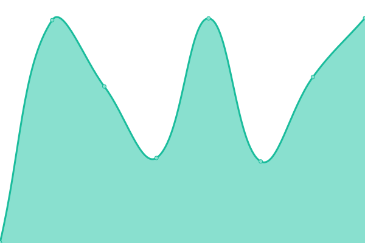
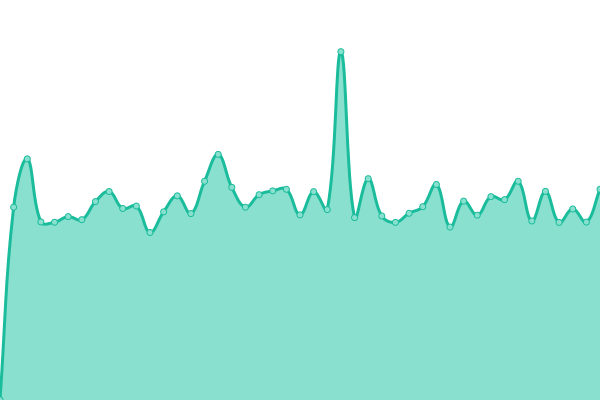
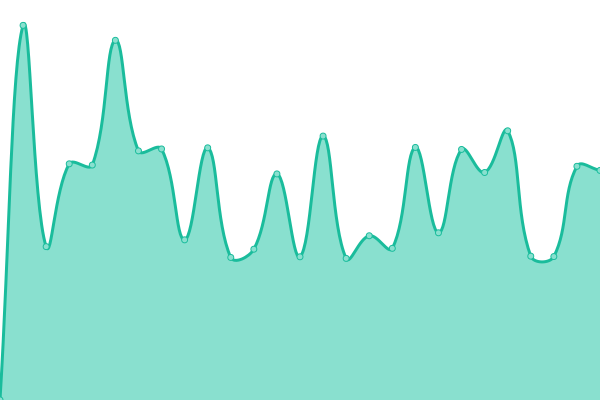

# [📈 Live Status](https://xiotzsupport.github.io/xIoTzcs-Uptime): <!--live status--> **🟧 Partial outage**

This repository contains the open-source uptime monitor and status page for [xiotzsupport](https://xiotzsupport.github.io/xIoTzcs-Uptime), powered by [Upptime](https://github.com/upptime/upptime).

With [Upptime](https://upptime.js.org), you can get your own unlimited and free uptime monitor and status page, powered entirely by a GitHub repository. We use [Issues](https://github.com/xiotzsupport/xIoTzcs-Uptime/issues) as incident reports, [Actions](https://github.com/xiotzsupport/xIoTzcs-Uptime/actions) as uptime monitors, and [Pages](https://xiotzsupport.github.io/xIoTzcs-Uptime) for the status page.

<!--start: status pages-->
<!-- This summary is generated by Upptime (https://github.com/upptime/upptime) -->
<!-- Do not edit this manually, your changes will be overwritten -->
<!-- prettier-ignore -->
| URL | Status | History | Response Time | Uptime |
| --- | ------ | ------- | ------------- | ------ |
|  [10_Dovetail-Domain](https://www.dovetailindia.com/) | 🟩 Up | [10-dovetail-domain.yml](https://github.com/xiotzsupport/xIoTzcs-Uptime/commits/HEAD/history/10-dovetail-domain.yml) | 

 1536ms
     
 | 

<a href="https://Status-CX.xiotz.com/history/10-dovetail-domain">100.00%</a>
    

|  [11_Dovetail-ClientOnBorarding](https://clientonboarding.dovetailindia.com) | 🟩 Up | [11-dovetail-client-on-borarding.yml](https://github.com/xiotzsupport/xIoTzcs-Uptime/commits/HEAD/history/11-dovetail-client-on-borarding.yml) | 

 1000ms
     
 | 

<a href="https://Status-CX.xiotz.com/history/11-dovetail-client-on-borarding">100.00%</a>
    

|  [12_Dovetail-DCMS](https://dcms.dovetailindia.com) | 🟩 Up | [12-dovetail-dcms.yml](https://github.com/xiotzsupport/xIoTzcs-Uptime/commits/HEAD/history/12-dovetail-dcms.yml) | 

 959ms
     
 | 

<a href="https://Status-CX.xiotz.com/history/12-dovetail-dcms">100.00%</a>
    

|  [13_Dovetail-DemoClientOnboarding](https://demo-clientonboarding.dovetailindia.com) | 🟩 Up | [13-dovetail-demo-client-onboarding.yml](https://github.com/xiotzsupport/xIoTzcs-Uptime/commits/HEAD/history/13-dovetail-demo-client-onboarding.yml) | 

 996ms
     
 | 

<a href="https://Status-CX.xiotz.com/history/13-dovetail-demo-client-onboarding">100.00%</a>
    

|  [14_Dovetail-Eprotector](https://eprotector.dovetailindia.com) | 🟩 Up | [14-dovetail-eprotector.yml](https://github.com/xiotzsupport/xIoTzcs-Uptime/commits/HEAD/history/14-dovetail-eprotector.yml) | 

 831ms
     
 | 

<a href="https://Status-CX.xiotz.com/history/14-dovetail-eprotector">100.00%</a>
    

|  [17_Dovetail-OMS](https://oms.dovetailindia.com/) | 🟩 Up | [17-dovetail-oms.yml](https://github.com/xiotzsupport/xIoTzcs-Uptime/commits/HEAD/history/17-dovetail-oms.yml) | 

 765ms
     
 | 

<a href="https://Status-CX.xiotz.com/history/17-dovetail-oms">100.00%</a>
    

|  [18_Dovetail-OMSAPI](https://oms-api.dovetailindia.com) | 🟩 Up | [18-dovetail-omsapi.yml](https://github.com/xiotzsupport/xIoTzcs-Uptime/commits/HEAD/history/18-dovetail-omsapi.yml) | 

 992ms
     
 | 

<a href="https://Status-CX.xiotz.com/history/18-dovetail-omsapi">100.00%</a>
    

|  [21_OneXtel-VAPTVOICE](https://vaptvoice.onextel.com) | 🟩 Up | [21-one-xtel-vaptvoice.yml](https://github.com/xiotzsupport/xIoTzcs-Uptime/commits/HEAD/history/21-one-xtel-vaptvoice.yml) | 

 1403ms
     
 | 

<a href="https://Status-CX.xiotz.com/history/21-one-xtel-vaptvoice">100.00%</a>
    

|  [22_OneXtel-Signature](https://signature.onextel.com) | 🟩 Up | [22-one-xtel-signature.yml](https://github.com/xiotzsupport/xIoTzcs-Uptime/commits/HEAD/history/22-one-xtel-signature.yml) | 

 336ms
     
 | 

<a href="https://Status-CX.xiotz.com/history/22-one-xtel-signature">100.00%</a>
    

|  [23_OneXtel-Service](https://service.onextel.com/) | 🟥 Down | [23-one-xtel-service.yml](https://github.com/xiotzsupport/xIoTzcs-Uptime/commits/HEAD/history/23-one-xtel-service.yml) | 

 0ms
     
 | 

<a href="https://Status-CX.xiotz.com/history/23-one-xtel-service">0.00%</a>
    

|  [24_OneXtel-APPCpass](https://app.cpaas.onextel.com) | 🟥 Down | [24-one-xtel-app-cpass.yml](https://github.com/xiotzsupport/xIoTzcs-Uptime/commits/HEAD/history/24-one-xtel-app-cpass.yml) | 

 0ms
     
 | 

<a href="https://Status-CX.xiotz.com/history/24-one-xtel-app-cpass">0.00%</a>
    

|  [25_OneXtel-Assist](https://assist.onextel.com) | 🟥 Down | [25-one-xtel-assist.yml](https://github.com/xiotzsupport/xIoTzcs-Uptime/commits/HEAD/history/25-one-xtel-assist.yml) | 

 0ms
     
 | 

<a href="https://Status-CX.xiotz.com/history/25-one-xtel-assist">0.00%</a>
    

|  [26_OneXtel-ATS](https://ats.onextel.com) | 🟥 Down | [26-one-xtel-ats.yml](https://github.com/xiotzsupport/xIoTzcs-Uptime/commits/HEAD/history/26-one-xtel-ats.yml) | 

 0ms
     
 | 

<a href="https://Status-CX.xiotz.com/history/26-one-xtel-ats">0.00%</a>
    

|  [27_OneXtel-Blog](https://blog.onextel.com/) | 🟥 Down | [27-one-xtel-blog.yml](https://github.com/xiotzsupport/xIoTzcs-Uptime/commits/HEAD/history/27-one-xtel-blog.yml) | 

 767ms
     
 | 

<a href="https://Status-CX.xiotz.com/history/27-one-xtel-blog">0.00%</a>
    

|  [28_OneXtel-Books](https://books.onextel.com) | 🟥 Down | [28-one-xtel-books.yml](https://github.com/xiotzsupport/xIoTzcs-Uptime/commits/HEAD/history/28-one-xtel-books.yml) | 

 0ms
     
 | 

<a href="https://Status-CX.xiotz.com/history/28-one-xtel-books">0.00%</a>
    

|  [29_OneXtel-Careers](https://careers.onextel.com) | 🟥 Down | [29-one-xtel-careers.yml](https://github.com/xiotzsupport/xIoTzcs-Uptime/commits/HEAD/history/29-one-xtel-careers.yml) | 

 1244ms
     
 | 

<a href="https://Status-CX.xiotz.com/history/29-one-xtel-careers">98.60%</a>
    

|  [30_OneXtel-Celebrate](https://celebrate.onextel.com/) | 🟩 Up | [30-one-xtel-celebrate.yml](https://github.com/xiotzsupport/xIoTzcs-Uptime/commits/HEAD/history/30-one-xtel-celebrate.yml) | 

 280ms
     
 | 

<a href="https://Status-CX.xiotz.com/history/30-one-xtel-celebrate">100.00%</a>
    

|  [31_OneXtel-Chat](https://chat.onextel.com) | 🟥 Down | [31-one-xtel-chat.yml](https://github.com/xiotzsupport/xIoTzcs-Uptime/commits/HEAD/history/31-one-xtel-chat.yml) | 

 0ms
     
 | 

<a href="https://Status-CX.xiotz.com/history/31-one-xtel-chat">0.00%</a>
    

|  [33_OneXtel-Docs](https://docs.onextel.com/) | 🟥 Down | [33-one-xtel-docs.yml](https://github.com/xiotzsupport/xIoTzcs-Uptime/commits/HEAD/history/33-one-xtel-docs.yml) | 

 1918ms
     
 | 

<a href="https://Status-CX.xiotz.com/history/33-one-xtel-docs">98.64%</a>
    

|  [121_JLMorison](https://www.jlmorison.com) | 🟥 Down | [121-jl-morison.yml](https://github.com/xiotzsupport/xIoTzcs-Uptime/commits/HEAD/history/121-jl-morison.yml) | 

 0ms
     
 | 

<a href="https://Status-CX.xiotz.com/history/121-jl-morison">100.00%</a>
    

|  [141_Unishield360-Domain](https://www.unishield360.com) | 🟥 Down | [141-unishield360-domain.yml](https://github.com/xiotzsupport/xIoTzcs-Uptime/commits/HEAD/history/141-unishield360-domain.yml) | 

 3806ms
     
 | 

<a href="https://Status-CX.xiotz.com/history/141-unishield360-domain">98.66%</a>
    

|  [142_Unishield360-UrbanPlan](https://www.urbanplan.unishield360.com) | 🟥 Down | [142-unishield360-urban-plan.yml](https://github.com/xiotzsupport/xIoTzcs-Uptime/commits/HEAD/history/142-unishield360-urban-plan.yml) | 

 0ms
     
 | 

<a href="https://Status-CX.xiotz.com/history/142-unishield360-urban-plan">0.00%</a>
    

|  [71_Medseven](https://www.med7healthcare.com) | 🟩 Up | [71-medseven.yml](https://github.com/xiotzsupport/xIoTzcs-Uptime/commits/HEAD/history/71-medseven.yml) | 

 1207ms
     
 | 

<a href="https://Status-CX.xiotz.com/history/71-medseven">100.00%</a>
    

|  [151_CICON-Domain](https://www.cicon.net) | 🟩 Up | [151-cicon-domain.yml](https://github.com/xiotzsupport/xIoTzcs-Uptime/commits/HEAD/history/151-cicon-domain.yml) | 

 1696ms
     
 | 

<a href="https://Status-CX.xiotz.com/history/151-cicon-domain">100.00%</a>
    

|  [152_CICON-VPN](https://vpn.cicon.net) | 🟥 Down | [152-cicon-vpn.yml](https://github.com/xiotzsupport/xIoTzcs-Uptime/commits/HEAD/history/152-cicon-vpn.yml) | 

 0ms
     
 | 

<a href="https://Status-CX.xiotz.com/history/152-cicon-vpn">0.00%</a>
    

|  [153_CICON-SMTP](https://smtp.cicon.net) | 🟥 Down | [153-cicon-smtp.yml](https://github.com/xiotzsupport/xIoTzcs-Uptime/commits/HEAD/history/153-cicon-smtp.yml) | 

 0ms
     
 | 

<a href="https://Status-CX.xiotz.com/history/153-cicon-smtp">0.00%</a>
    

|  [154_CICON-E](https://e.cicon.net) | 🟥 Down | [154-cicon-e.yml](https://github.com/xiotzsupport/xIoTzcs-Uptime/commits/HEAD/history/154-cicon-e.yml) | 

 0ms
     
 | 

<a href="https://Status-CX.xiotz.com/history/154-cicon-e">0.00%</a>
    

|  [155_CICON-IMAP](https://imap.cicon.net) | 🟥 Down | [155-cicon-imap.yml](https://github.com/xiotzsupport/xIoTzcs-Uptime/commits/HEAD/history/155-cicon-imap.yml) | 

 0ms
     
 | 

<a href="https://Status-CX.xiotz.com/history/155-cicon-imap">0.00%</a>
    

|  [156_CICON-Mail](https://mail.cicon.net) | 🟥 Down | [156-cicon-mail.yml](https://github.com/xiotzsupport/xIoTzcs-Uptime/commits/HEAD/history/156-cicon-mail.yml) | 

 0ms
     
 | 

<a href="https://Status-CX.xiotz.com/history/156-cicon-mail">0.00%</a>
    

|  [171_ALOmeria-Domain](https://www.omeirapp.ae) | 🟩 Up | [171-al-omeria-domain.yml](https://github.com/xiotzsupport/xIoTzcs-Uptime/commits/HEAD/history/171-al-omeria-domain.yml) | 

 1769ms
     
 | 

<a href="https://Status-CX.xiotz.com/history/171-al-omeria-domain">99.50%</a>
    

<!--end: status pages-->

[**Visit our status website →**](https://xiotzsupport.github.io/xIoTzcs-Uptime)

## 📄 License

- Powered by: [Upptime](https://github.com/upptime/upptime)
- Code: [MIT](./LICENSE) © [Anand Chowdhary](https://anandchowdhary.com), supported by [Pabio](https://pabio.com)
- Data in the `./history` directory: [Open Database License](https://opendatacommons.org/licenses/odbl/1-0/)
