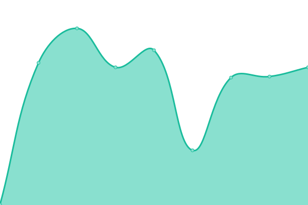

# [📈 Live Status](https://xiotzsupport.github.io/xIoTzcs-Uptime): <!--live status--> **🟧 Partial outage**

This repository contains the open-source uptime monitor and status page for [xiotzsupport](https://xiotzsupport.github.io/xIoTzcs-Uptime), powered by [Upptime](https://github.com/upptime/upptime).

With [Upptime](https://upptime.js.org), you can get your own unlimited and free uptime monitor and status page, powered entirely by a GitHub repository. We use [Issues](https://github.com/xiotzsupport/xIoTzcs-Uptime/issues) as incident reports, [Actions](https://github.com/xiotzsupport/xIoTzcs-Uptime/actions) as uptime monitors, and [Pages](https://xiotzsupport.github.io/xIoTzcs-Uptime) for the status page.

<!--start: status pages-->
<!-- This summary is generated by Upptime (https://github.com/upptime/upptime) -->
<!-- Do not edit this manually, your changes will be overwritten -->
<!-- prettier-ignore -->
| URL | Status | History | Response Time | Uptime |
| --- | ------ | ------- | ------------- | ------ |
|  [10_Dovetail](https://www.dovetailindia.com/) | 🟩 Up | [10-dovetail.yml](https://github.com/xiotzsupport/xIoTzcs-Uptime/commits/HEAD/history/10-dovetail.yml) | 

 1348ms
     
 | 

<a href="https://Status-CX.xiotz.com/history/10-dovetail">100.00%</a>
    

|  [11_Dovetail](https://clientonboarding.dovetailindia.com) | 🟩 Up | [11-dovetail.yml](https://github.com/xiotzsupport/xIoTzcs-Uptime/commits/HEAD/history/11-dovetail.yml) | 

 894ms
     
 | 

<a href="https://Status-CX.xiotz.com/history/11-dovetail">100.00%</a>
    

|  [12_Dovetail](https://dcms.dovetailindia.com) | 🟩 Up | [12-dovetail.yml](https://github.com/xiotzsupport/xIoTzcs-Uptime/commits/HEAD/history/12-dovetail.yml) | 

 789ms
     
 | 

<a href="https://Status-CX.xiotz.com/history/12-dovetail">100.00%</a>
    

|  [13_Dovetail](https://demo-clientonboarding.dovetailindia.com) | 🟩 Up | [13-dovetail.yml](https://github.com/xiotzsupport/xIoTzcs-Uptime/commits/HEAD/history/13-dovetail.yml) | 

 859ms
     
 | 

<a href="https://Status-CX.xiotz.com/history/13-dovetail">100.00%</a>
    

|  [14_Dovetail](https://eprotector.dovetailindia.com) | 🟩 Up | [14-dovetail.yml](https://github.com/xiotzsupport/xIoTzcs-Uptime/commits/HEAD/history/14-dovetail.yml) | 

 789ms
     
 | 

<a href="https://Status-CX.xiotz.com/history/14-dovetail">100.00%</a>
    

|  [15_Dovetail](https://nav.dovetailindia.com/) | 🟩 Up | [15-dovetail.yml](https://github.com/xiotzsupport/xIoTzcs-Uptime/commits/HEAD/history/15-dovetail.yml) | 

 753ms
     
 | 

<a href="https://Status-CX.xiotz.com/history/15-dovetail">100.00%</a>
    

|  [16_Dovetail](http://navdev.dovetailindia.com) | 🟩 Up | [16-dovetail.yml](https://github.com/xiotzsupport/xIoTzcs-Uptime/commits/HEAD/history/16-dovetail.yml) | 

 1106ms
     
 | 

<a href="https://Status-CX.xiotz.com/history/16-dovetail">100.00%</a>
    

|  [17_Dovetail](https://oms.dovetailindia.com/) | 🟩 Up | [17-dovetail.yml](https://github.com/xiotzsupport/xIoTzcs-Uptime/commits/HEAD/history/17-dovetail.yml) | 

 664ms
     
 | 

<a href="https://Status-CX.xiotz.com/history/17-dovetail">100.00%</a>
    

|  [18_Dovetail](https://oms-api.dovetailindia.com) | 🟩 Up | [18-dovetail.yml](https://github.com/xiotzsupport/xIoTzcs-Uptime/commits/HEAD/history/18-dovetail.yml) | 

 852ms
     
 | 

<a href="https://Status-CX.xiotz.com/history/18-dovetail">100.00%</a>
    

|  [19_Dovetail](https://api.uat.nav.dovetailindia.com/) | 🟩 Up | [19-dovetail.yml](https://github.com/xiotzsupport/xIoTzcs-Uptime/commits/HEAD/history/19-dovetail.yml) | 

 732ms
     
 | 

<a href="https://Status-CX.xiotz.com/history/19-dovetail">100.00%</a>
    

|  [21_OneXtel](https://vaptvoice.onextel.com) | 🟩 Up | [21-one-xtel.yml](https://github.com/xiotzsupport/xIoTzcs-Uptime/commits/HEAD/history/21-one-xtel.yml) | 

 1373ms
     
 | 

<a href="https://Status-CX.xiotz.com/history/21-one-xtel">100.00%</a>
    

|  [22_OneXtel](https://signature.onextel.com) | 🟩 Up | [22-one-xtel.yml](https://github.com/xiotzsupport/xIoTzcs-Uptime/commits/HEAD/history/22-one-xtel.yml) | 

 383ms
     
 | 

<a href="https://Status-CX.xiotz.com/history/22-one-xtel">100.00%</a>
    

|  [23_OneXtel](https://service.onextel.com/) | 🟥 Down | [23-one-xtel.yml](https://github.com/xiotzsupport/xIoTzcs-Uptime/commits/HEAD/history/23-one-xtel.yml) | 

 0ms
     
 | 

<a href="https://Status-CX.xiotz.com/history/23-one-xtel">0.00%</a>
    

|  [24_OneXtel](https://app.cpaas.onextel.com) | 🟩 Up | [24-one-xtel.yml](https://github.com/xiotzsupport/xIoTzcs-Uptime/commits/HEAD/history/24-one-xtel.yml) | 

 685ms
     
 | 

<a href="https://Status-CX.xiotz.com/history/24-one-xtel">100.00%</a>
    

|  [25_OneXtel](https://assist.onextel.com) | 🟩 Up | [25-one-xtel.yml](https://github.com/xiotzsupport/xIoTzcs-Uptime/commits/HEAD/history/25-one-xtel.yml) | 

 2785ms
     
 | 

<a href="https://Status-CX.xiotz.com/history/25-one-xtel">100.00%</a>
    

|  [26_OneXtel](https://ats.onextel.com) | 🟥 Down | [26-one-xtel.yml](https://github.com/xiotzsupport/xIoTzcs-Uptime/commits/HEAD/history/26-one-xtel.yml) | 

 0ms
     
 | 

<a href="https://Status-CX.xiotz.com/history/26-one-xtel">0.06%</a>
    

|  [27_OneXtel](https://blog.onextel.com/) | 🟩 Up | [27-one-xtel.yml](https://github.com/xiotzsupport/xIoTzcs-Uptime/commits/HEAD/history/27-one-xtel.yml) | 

 2666ms
     
 | 

<a href="https://Status-CX.xiotz.com/history/27-one-xtel">100.00%</a>
    

|  [28_OneXtel](https://books.onextel.com) | 🟩 Up | [28-one-xtel.yml](https://github.com/xiotzsupport/xIoTzcs-Uptime/commits/HEAD/history/28-one-xtel.yml) | 

 711ms
     
 | 

<a href="https://Status-CX.xiotz.com/history/28-one-xtel">100.00%</a>
    

|  [29_OneXtel](https://careers.onextel.com) | 🟩 Up | [29-one-xtel.yml](https://github.com/xiotzsupport/xIoTzcs-Uptime/commits/HEAD/history/29-one-xtel.yml) | 

 2034ms
     
 | 

<a href="https://Status-CX.xiotz.com/history/29-one-xtel">100.00%</a>
    

|  [30_OneXtel](https://celebrate.onextel.com/) | 🟩 Up | [30-one-xtel.yml](https://github.com/xiotzsupport/xIoTzcs-Uptime/commits/HEAD/history/30-one-xtel.yml) | 

 189ms
     
 | 

<a href="https://Status-CX.xiotz.com/history/30-one-xtel">100.00%</a>
    

|  [31_OneXtel](https://chat.onextel.com) | 🟩 Up | [31-one-xtel.yml](https://github.com/xiotzsupport/xIoTzcs-Uptime/commits/HEAD/history/31-one-xtel.yml) | 

 2676ms
     
 | 

<a href="https://Status-CX.xiotz.com/history/31-one-xtel">100.00%</a>
    

|  [32_OneXtel](https://crm.onextel.com/) | 🟩 Up | [32-one-xtel.yml](https://github.com/xiotzsupport/xIoTzcs-Uptime/commits/HEAD/history/32-one-xtel.yml) | 

 834ms
     
 | 

<a href="https://Status-CX.xiotz.com/history/32-one-xtel">100.00%</a>
    

|  [33_OneXtel](https://docs.onextel.com/) | 🟩 Up | [33-one-xtel.yml](https://github.com/xiotzsupport/xIoTzcs-Uptime/commits/HEAD/history/33-one-xtel.yml) | 

 1953ms
     
 | 

<a href="https://Status-CX.xiotz.com/history/33-one-xtel">100.00%</a>
    

|  [34_OneXtel](https://email.onextel.com/) | 🟥 Down | [34-one-xtel.yml](https://github.com/xiotzsupport/xIoTzcs-Uptime/commits/HEAD/history/34-one-xtel.yml) | 

 0ms
     
 | 

<a href="https://Status-CX.xiotz.com/history/34-one-xtel">0.05%</a>
    

|  [35_OneXtel](https://global.onextel.com/) | 🟥 Down | [35-one-xtel.yml](https://github.com/xiotzsupport/xIoTzcs-Uptime/commits/HEAD/history/35-one-xtel.yml) | 

 0ms
     
 | 

<a href="https://Status-CX.xiotz.com/history/35-one-xtel">0.03%</a>
    

|  [Google](https://www.google.com) | 🟩 Up | [google.yml](https://github.com/xiotzsupport/xIoTzcs-Uptime/commits/HEAD/history/google.yml) | 

 106ms
     
 | 

<a href="https://Status-CX.xiotz.com/history/google">100.00%</a>
    

|  [Wikipedia](https://en.wikipedia.org) | 🟩 Up | [wikipedia.yml](https://github.com/xiotzsupport/xIoTzcs-Uptime/commits/HEAD/history/wikipedia.yml) | 

 138ms
     
 | 

<a href="https://Status-CX.xiotz.com/history/wikipedia">100.00%</a>
    

|  [Hacker News](https://news.ycombinator.com) | 🟩 Up | [hacker-news.yml](https://github.com/xiotzsupport/xIoTzcs-Uptime/commits/HEAD/history/hacker-news.yml) | 

 385ms
     
 | 

<a href="https://Status-CX.xiotz.com/history/hacker-news">100.00%</a>
    

|  [Test Broken Site](https://thissitedoesnotexist.koj.co) | 🟥 Down | [test-broken-site.yml](https://github.com/xiotzsupport/xIoTzcs-Uptime/commits/HEAD/history/test-broken-site.yml) | 

 0ms
     
 | 

<a href="https://Status-CX.xiotz.com/history/test-broken-site">100.00%</a>
    

|  [IPv6 test](forwardemail.net) | 🟥 Down | [i-pv6-test.yml](https://github.com/xiotzsupport/xIoTzcs-Uptime/commits/HEAD/history/i-pv6-test.yml) | 

 0ms
     
 | 

<a href="https://Status-CX.xiotz.com/history/i-pv6-test">100.00%</a>
    

|  [UcapTDAC](https://tdac.xiotz.com/) | 🟩 Up | [ucap-tdac.yml](https://github.com/xiotzsupport/xIoTzcs-Uptime/commits/HEAD/history/ucap-tdac.yml) | 

 9593ms
     
 | 

<a href="https://Status-CX.xiotz.com/history/ucap-tdac">78.36%</a>
    

<!--end: status pages-->

[**Visit our status website →**](https://xiotzsupport.github.io/xIoTzcs-Uptime)

## 📄 License

- Powered by: [Upptime](https://github.com/upptime/upptime)
- Code: [MIT](./LICENSE) © [Anand Chowdhary](https://anandchowdhary.com), supported by [Pabio](https://pabio.com)
- Data in the `./history` directory: [Open Database License](https://opendatacommons.org/licenses/odbl/1-0/)
