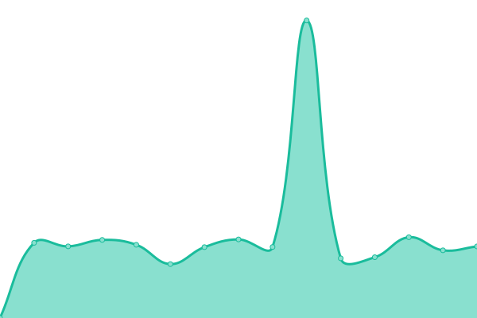
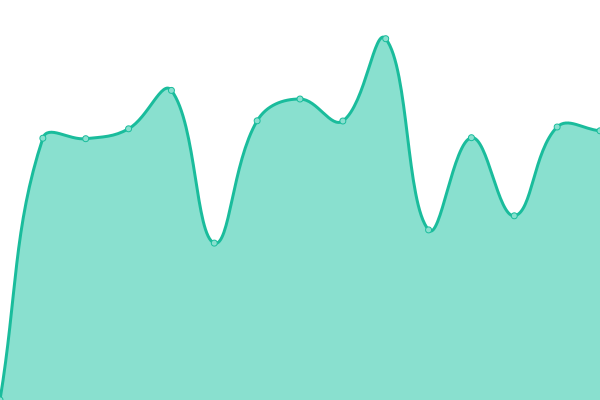
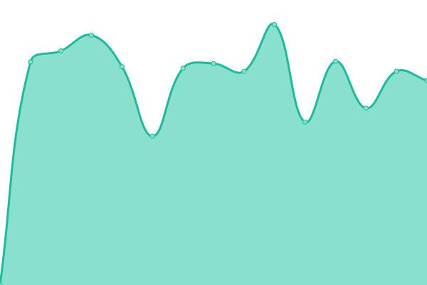
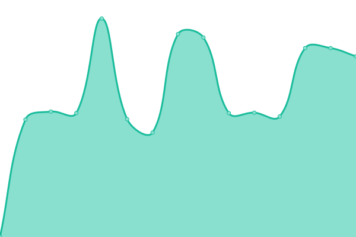

# [📈 Live Status](https://xiotzsupport.github.io/xIoTzcs-Uptime): <!--live status--> **🟧 Partial outage**

This repository contains the open-source uptime monitor and status page for [xiotzsupport](https://xiotzsupport.github.io/xIoTzcs-Uptime), powered by [Upptime](https://github.com/upptime/upptime).

With [Upptime](https://upptime.js.org), you can get your own unlimited and free uptime monitor and status page, powered entirely by a GitHub repository. We use [Issues](https://github.com/xiotzsupport/xIoTzcs-Uptime/issues) as incident reports, [Actions](https://github.com/xiotzsupport/xIoTzcs-Uptime/actions) as uptime monitors, and [Pages](https://xiotzsupport.github.io/xIoTzcs-Uptime) for the status page.

<!--start: status pages-->
<!-- This summary is generated by Upptime (https://github.com/upptime/upptime) -->
<!-- Do not edit this manually, your changes will be overwritten -->
<!-- prettier-ignore -->
| URL | Status | History | Response Time | Uptime |
| --- | ------ | ------- | ------------- | ------ |
|  [10_Dovetail](https://www.dovetailindia.com/) | 🟩 Up | [10-dovetail.yml](https://github.com/xiotzsupport/xIoTzcs-Uptime/commits/HEAD/history/10-dovetail.yml) | 

 1491ms
     
 | 

<a href="https://Status-CX.xiotz.com/history/10-dovetail">100.00%</a>
    

|  [11_Dovetail](https://clientonboarding.dovetailindia.com) | 🟩 Up | [11-dovetail.yml](https://github.com/xiotzsupport/xIoTzcs-Uptime/commits/HEAD/history/11-dovetail.yml) | 

 983ms
     
 | 

<a href="https://Status-CX.xiotz.com/history/11-dovetail">100.00%</a>
    

|  [12_Dovetail](https://dcms.dovetailindia.com) | 🟩 Up | [12-dovetail.yml](https://github.com/xiotzsupport/xIoTzcs-Uptime/commits/HEAD/history/12-dovetail.yml) | 

 961ms
     
 | 

<a href="https://Status-CX.xiotz.com/history/12-dovetail">100.00%</a>
    

|  [13_Dovetail](https://demo-clientonboarding.dovetailindia.com) | 🟩 Up | [13-dovetail.yml](https://github.com/xiotzsupport/xIoTzcs-Uptime/commits/HEAD/history/13-dovetail.yml) | 

 966ms
     
 | 

<a href="https://Status-CX.xiotz.com/history/13-dovetail">100.00%</a>
    

|  [14_Dovetail](https://eprotector.dovetailindia.com) | 🟩 Up | [14-dovetail.yml](https://github.com/xiotzsupport/xIoTzcs-Uptime/commits/HEAD/history/14-dovetail.yml) | 

 851ms
     
 | 

<a href="https://Status-CX.xiotz.com/history/14-dovetail">100.00%</a>
    

|  [15_Dovetail](https://nav.dovetailindia.com/) | 🟥 Down | [15-dovetail.yml](https://github.com/xiotzsupport/xIoTzcs-Uptime/commits/HEAD/history/15-dovetail.yml) | 

 0ms
     
 | 

<a href="https://Status-CX.xiotz.com/history/15-dovetail">100.00%</a>
    

|  [17_Dovetail (https://oms.dovetailindia.com/)](https://oms.dovetailindia.com/) | 🟩 Up | [17-dovetail-https-oms-dovetailindia-com.yml](https://github.com/xiotzsupport/xIoTzcs-Uptime/commits/HEAD/history/17-dovetail-https-oms-dovetailindia-com.yml) | 

 749ms
     
 | 

<a href="https://Status-CX.xiotz.com/history/17-dovetail-https-oms-dovetailindia-com">100.00%</a>
    

|  [18_Dovetail](https://oms-api.dovetailindia.com) | 🟩 Up | [18-dovetail.yml](https://github.com/xiotzsupport/xIoTzcs-Uptime/commits/HEAD/history/18-dovetail.yml) | 

 964ms
     
 | 

<a href="https://Status-CX.xiotz.com/history/18-dovetail">100.00%</a>
    

|  [21_OneXtel](https://vaptvoice.onextel.com) | 🟩 Up | [21-one-xtel.yml](https://github.com/xiotzsupport/xIoTzcs-Uptime/commits/HEAD/history/21-one-xtel.yml) | 

 1386ms
     
 | 

<a href="https://Status-CX.xiotz.com/history/21-one-xtel">100.00%</a>
    

|  [22_OneXtel](https://signature.onextel.com) | 🟩 Up | [22-one-xtel.yml](https://github.com/xiotzsupport/xIoTzcs-Uptime/commits/HEAD/history/22-one-xtel.yml) | 

 219ms
     
 | 

<a href="https://Status-CX.xiotz.com/history/22-one-xtel">100.00%</a>
    

|  [23_OneXtel](https://service.onextel.com/) | 🟥 Down | [23-one-xtel.yml](https://github.com/xiotzsupport/xIoTzcs-Uptime/commits/HEAD/history/23-one-xtel.yml) | 

 0ms
     
 | 

<a href="https://Status-CX.xiotz.com/history/23-one-xtel">0.00%</a>
    

|  [24_OneXtel](https://app.cpaas.onextel.com) | 🟥 Down | [24-one-xtel.yml](https://github.com/xiotzsupport/xIoTzcs-Uptime/commits/HEAD/history/24-one-xtel.yml) | 

 0ms
     
 | 

<a href="https://Status-CX.xiotz.com/history/24-one-xtel">0.00%</a>
    

|  [25_OneXtel](https://assist.onextel.com) | 🟥 Down | [25-one-xtel.yml](https://github.com/xiotzsupport/xIoTzcs-Uptime/commits/HEAD/history/25-one-xtel.yml) | 

 0ms
     
 | 

<a href="https://Status-CX.xiotz.com/history/25-one-xtel">100.00%</a>
    

|  [26_OneXtel](https://ats.onextel.com) | 🟥 Down | [26-one-xtel.yml](https://github.com/xiotzsupport/xIoTzcs-Uptime/commits/HEAD/history/26-one-xtel.yml) | 

 0ms
     
 | 

<a href="https://Status-CX.xiotz.com/history/26-one-xtel">0.00%</a>
    

|  [27_OneXtel](https://blog.onextel.com/) | 🟥 Down | [27-one-xtel.yml](https://github.com/xiotzsupport/xIoTzcs-Uptime/commits/HEAD/history/27-one-xtel.yml) | 

 756ms
     
 | 

<a href="https://Status-CX.xiotz.com/history/27-one-xtel">100.00%</a>
    

|  [28_OneXtel](https://books.onextel.com) | 🟥 Down | [28-one-xtel.yml](https://github.com/xiotzsupport/xIoTzcs-Uptime/commits/HEAD/history/28-one-xtel.yml) | 

 0ms
     
 | 

<a href="https://Status-CX.xiotz.com/history/28-one-xtel">100.00%</a>
    

|  [29_OneXtel](https://careers.onextel.com) | 🟥 Down | [29-one-xtel.yml](https://github.com/xiotzsupport/xIoTzcs-Uptime/commits/HEAD/history/29-one-xtel.yml) | 

 1819ms
     
 | 

<a href="https://Status-CX.xiotz.com/history/29-one-xtel">97.39%</a>
    

|  [30_OneXtel](https://celebrate.onextel.com/) | 🟩 Up | [30-one-xtel.yml](https://github.com/xiotzsupport/xIoTzcs-Uptime/commits/HEAD/history/30-one-xtel.yml) | 

 228ms
     
 | 

<a href="https://Status-CX.xiotz.com/history/30-one-xtel">100.00%</a>
    

|  [31_OneXtel](https://chat.onextel.com) | 🟥 Down | [31-one-xtel.yml](https://github.com/xiotzsupport/xIoTzcs-Uptime/commits/HEAD/history/31-one-xtel.yml) | 

 0ms
     
 | 

<a href="https://Status-CX.xiotz.com/history/31-one-xtel">100.00%</a>
    

|  [33_OneXtel](https://docs.onextel.com/) | 🟥 Down | [33-one-xtel.yml](https://github.com/xiotzsupport/xIoTzcs-Uptime/commits/HEAD/history/33-one-xtel.yml) | 

 2539ms
     
 | 

<a href="https://Status-CX.xiotz.com/history/33-one-xtel">97.43%</a>
    

|  [121_JLMorison](https://www.jlmorison.com) | 🟥 Down | [121-jl-morison.yml](https://github.com/xiotzsupport/xIoTzcs-Uptime/commits/HEAD/history/121-jl-morison.yml) | 

 0ms
     
 | 

<a href="https://Status-CX.xiotz.com/history/121-jl-morison">0.00%</a>
    

|  [141_Unishield360](https://www.unishield360.com) | 🟥 Down | [141-unishield360.yml](https://github.com/xiotzsupport/xIoTzcs-Uptime/commits/HEAD/history/141-unishield360.yml) | 

 4464ms
     
 | 

<a href="https://Status-CX.xiotz.com/history/141-unishield360">97.45%</a>
    

|  [142_Unishield360](https://www.urbanplan.unishield360.com) | 🟥 Down | [142-unishield360.yml](https://github.com/xiotzsupport/xIoTzcs-Uptime/commits/HEAD/history/142-unishield360.yml) | 

 0ms
     
 | 

<a href="https://Status-CX.xiotz.com/history/142-unishield360">100.00%</a>
    

|  [71_Medseven](https://www.med7healthcare.com) | 🟩 Up | [71-medseven.yml](https://github.com/xiotzsupport/xIoTzcs-Uptime/commits/HEAD/history/71-medseven.yml) | 

 1211ms
     
 | 

<a href="https://Status-CX.xiotz.com/history/71-medseven">100.00%</a>
    

|  [72_Medseven](https://new.med7healthcare.com) | 🟥 Down | [72-medseven.yml](https://github.com/xiotzsupport/xIoTzcs-Uptime/commits/HEAD/history/72-medseven.yml) | 

 0ms
     
 | 

<a href="https://Status-CX.xiotz.com/history/72-medseven">100.00%</a>
    

|  [73_Medseven](https://enterpriseenrollment.med7healthcare.com) | 🟥 Down | [73-medseven.yml](https://github.com/xiotzsupport/xIoTzcs-Uptime/commits/HEAD/history/73-medseven.yml) | 

 0ms
     
 | 

<a href="https://Status-CX.xiotz.com/history/73-medseven">100.00%</a>
    

|  [74_Medseven](https://autodiscover.med7healthcare.com) | 🟥 Down | [74-medseven.yml](https://github.com/xiotzsupport/xIoTzcs-Uptime/commits/HEAD/history/74-medseven.yml) | 

 0ms
     
 | 

<a href="https://Status-CX.xiotz.com/history/74-medseven">100.00%</a>
    

|  [151_AlphaSeven](https://www.cicon.net) | 🟩 Up | [151-alpha-seven.yml](https://github.com/xiotzsupport/xIoTzcs-Uptime/commits/HEAD/history/151-alpha-seven.yml) | 

 1923ms
     
 | 

<a href="https://Status-CX.xiotz.com/history/151-alpha-seven">100.00%</a>
    

|  [152_AlphaSeven](https://vpn.cicon.net) | 🟥 Down | [152-alpha-seven.yml](https://github.com/xiotzsupport/xIoTzcs-Uptime/commits/HEAD/history/152-alpha-seven.yml) | 

 0ms
     
 | 

<a href="https://Status-CX.xiotz.com/history/152-alpha-seven">100.00%</a>
    

|  [153_AlphaSeven](https://smtp.cicon.net) | 🟥 Down | [153-alpha-seven.yml](https://github.com/xiotzsupport/xIoTzcs-Uptime/commits/HEAD/history/153-alpha-seven.yml) | 

 0ms
     
 | 

<a href="https://Status-CX.xiotz.com/history/153-alpha-seven">100.00%</a>
    

|  [154_AlphaSeven](https://e.cicon.net) | 🟥 Down | [154-alpha-seven.yml](https://github.com/xiotzsupport/xIoTzcs-Uptime/commits/HEAD/history/154-alpha-seven.yml) | 

 0ms
     
 | 

<a href="https://Status-CX.xiotz.com/history/154-alpha-seven">100.00%</a>
    

|  [155_AlphaSeven](https://imap.cicon.net) | 🟥 Down | [155-alpha-seven.yml](https://github.com/xiotzsupport/xIoTzcs-Uptime/commits/HEAD/history/155-alpha-seven.yml) | 

 0ms
     
 | 

<a href="https://Status-CX.xiotz.com/history/155-alpha-seven">100.00%</a>
    

|  [156_AlphaSeven](https://mail.cicon.net) | 🟥 Down | [156-alpha-seven.yml](https://github.com/xiotzsupport/xIoTzcs-Uptime/commits/HEAD/history/156-alpha-seven.yml) | 

 0ms
     
 | 

<a href="https://Status-CX.xiotz.com/history/156-alpha-seven">100.00%</a>
    

|  [171_ALOmeria](https://www.omeirapp.ae) | 🟩 Up | [171-al-omeria.yml](https://github.com/xiotzsupport/xIoTzcs-Uptime/commits/HEAD/history/171-al-omeria.yml) | 

 1656ms
     
 | 

<a href="https://Status-CX.xiotz.com/history/171-al-omeria">100.00%</a>
    

|  [181_Cicon](https://www.cicon.net) | 🟩 Up | [181-cicon.yml](https://github.com/xiotzsupport/xIoTzcs-Uptime/commits/HEAD/history/181-cicon.yml) | 

 1060ms
     
 | 

<a href="https://Status-CX.xiotz.com/history/181-cicon">100.00%</a>
    

|  [182_Cicon](https://vpn.cicon.net) | 🟥 Down | [182-cicon.yml](https://github.com/xiotzsupport/xIoTzcs-Uptime/commits/HEAD/history/182-cicon.yml) | 

 0ms
     
 | 

<a href="https://Status-CX.xiotz.com/history/182-cicon">100.00%</a>
    

|  [183_Cicon](https://smtp.cicon.net) | 🟥 Down | [183-cicon.yml](https://github.com/xiotzsupport/xIoTzcs-Uptime/commits/HEAD/history/183-cicon.yml) | 

 0ms
     
 | 

<a href="https://Status-CX.xiotz.com/history/183-cicon">100.00%</a>
    

|  [184_Cicon](https://e.cicon.net) | 🟥 Down | [184-cicon.yml](https://github.com/xiotzsupport/xIoTzcs-Uptime/commits/HEAD/history/184-cicon.yml) | 

 0ms
     
 | 

<a href="https://Status-CX.xiotz.com/history/184-cicon">100.00%</a>
    

|  [185_Cicon](https://imap.cicon.net) | 🟥 Down | [185-cicon.yml](https://github.com/xiotzsupport/xIoTzcs-Uptime/commits/HEAD/history/185-cicon.yml) | 

 0ms
     
 | 

<a href="https://Status-CX.xiotz.com/history/185-cicon">100.00%</a>
    

|  [185_Cicon](https://mail.cicon.net) | 🟥 Down | [185-cicon.yml](https://github.com/xiotzsupport/xIoTzcs-Uptime/commits/HEAD/history/185-cicon.yml) | 

 0ms
     
 | 

<a href="https://Status-CX.xiotz.com/history/185-cicon">100.00%</a>
    

|  [191_Bell](https://bell-energy.com) | 🟩 Up | [191-bell.yml](https://github.com/xiotzsupport/xIoTzcs-Uptime/commits/HEAD/history/191-bell.yml) | 

 1010ms
     
 | 

<a href="https://Status-CX.xiotz.com/history/191-bell">100.00%</a>
    

|  [201_Gemini](https://www.gti-me.com) | 🟥 Down | [201-gemini.yml](https://github.com/xiotzsupport/xIoTzcs-Uptime/commits/HEAD/history/201-gemini.yml) | 

 2897ms
     
 | 

<a href="https://Status-CX.xiotz.com/history/201-gemini">97.52%</a>
    

|  [202_Gemini](https://mail.gti-me.com) | 🟥 Down | [202-gemini.yml](https://github.com/xiotzsupport/xIoTzcs-Uptime/commits/HEAD/history/202-gemini.yml) | 

 2092ms
     
 | 

<a href="https://Status-CX.xiotz.com/history/202-gemini">97.57%</a>
    

|  [203_Gemini](https://cpanel.gti-me.com) | 🟩 Up | [203-gemini.yml](https://github.com/xiotzsupport/xIoTzcs-Uptime/commits/HEAD/history/203-gemini.yml) | 

 646ms
     
 | 

<a href="https://Status-CX.xiotz.com/history/203-gemini">100.00%</a>
    

|  [204_Gemini](https://server.gti-me.com) | 🟥 Down | [204-gemini.yml](https://github.com/xiotzsupport/xIoTzcs-Uptime/commits/HEAD/history/204-gemini.yml) | 

 0ms
     
 | 

<a href="https://Status-CX.xiotz.com/history/204-gemini">100.00%</a>
    

|  [205_Gemini](https://webdisk.gti-me.com) | 🟥 Down | [205-gemini.yml](https://github.com/xiotzsupport/xIoTzcs-Uptime/commits/HEAD/history/205-gemini.yml) | 

 496ms
     
 | 

<a href="https://Status-CX.xiotz.com/history/205-gemini">100.00%</a>
    

|  [206_Gemini](https://webmail.gti-me.com) | 🟩 Up | [206-gemini.yml](https://github.com/xiotzsupport/xIoTzcs-Uptime/commits/HEAD/history/206-gemini.yml) | 

 579ms
     
 | 

<a href="https://Status-CX.xiotz.com/history/206-gemini">100.00%</a>
    

|  [207_Gemini](https://xtrabakup.gti-me.com) | 🟥 Down | [207-gemini.yml](https://github.com/xiotzsupport/xIoTzcs-Uptime/commits/HEAD/history/207-gemini.yml) | 

 0ms
     
 | 

<a href="https://Status-CX.xiotz.com/history/207-gemini">100.00%</a>
    

|  [208_Gemini](https://cpcontacts.gti-me.com) | 🟥 Down | [208-gemini.yml](https://github.com/xiotzsupport/xIoTzcs-Uptime/commits/HEAD/history/208-gemini.yml) | 

 460ms
     
 | 

<a href="https://Status-CX.xiotz.com/history/208-gemini">100.00%</a>
    

<!--end: status pages-->

[**Visit our status website →**](https://xiotzsupport.github.io/xIoTzcs-Uptime)

## 📄 License

- Powered by: [Upptime](https://github.com/upptime/upptime)
- Code: [MIT](./LICENSE) © [Anand Chowdhary](https://anandchowdhary.com), supported by [Pabio](https://pabio.com)
- Data in the `./history` directory: [Open Database License](https://opendatacommons.org/licenses/odbl/1-0/)
